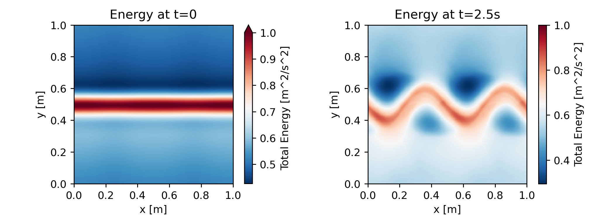

[](https://opensource.org/licenses/MIT)
[](https://fridom.readthedocs.io/en/latest/index.html)

[](https://www.youtube.com/watch?v=Fotni4P2ZQs)

# Framework for Idealized Ocean Models (FRIDOM)

- **Purpose & Flexibility:** FRIDOM is a powerful and modular framework originally developed for running simulations of idealized ocean models. Thanks to its modular design, it can be used to simulate any model represented by a set of partial differential equations, such as $\partial_t \boldsymbol{z} = \boldsymbol{f}(\boldsymbol{z}, t)$.

- **Minimizing Boilerplate Code:** To streamline the development process, FRIDOM provides base classes for common components like grids, differential and interpolation operators, time-stepping schemes, netCDF output, animations, etc.

- **Easy Model Modifications:** Every component of a model in FRIDOM is fully exchangeable without changing the model's source code. This feature makes FRIDOM an excellent sandbox for testing new ideas and a useful tool for educational purposes.

- **Balancing Flexibility & Usability:** While modular frameworks often compromise user-friendliness for flexibility, FRIDOM strives to be both flexible and easy to use. It offers a high-level [API](https://fridom.readthedocs.io/en/latest/fridom_api.html), comprehensive tutorials, and numerous [examples](https://fridom.readthedocs.io/en/latest/auto_examples/index.html) available within the [documentation](https://fridom.readthedocs.io/en/latest/index.html).

- **Performance through Python & JAX:** Written in Python for ease of use, FRIDOM overcomes Python's performance limitations by leveraging the Just-In-Time (JIT) compiler from JAX. This approach allows FRIDOM to achieve speeds comparable to compiled languages like Fortran or C, and it can further accelerate simulations by running on GPUs.

**NOTE: FRIDOM is in en early development stage, and as such, it may undergo significant changes.**

## Documentation
Learn more about FRIDOM in its official [documentation](https://fridom.readthedocs.io/en/latest/index.html).

## Installation
To install FRIDOM from the source code repository, clone the repository in your desired directory and install the package using pip:

``` bash
git clone https://github.com/Gordi42/FRIDOM
cd FRIDOM
pip install -e '.[jax-cuda]'
```
see [here](https://fridom.readthedocs.io/en/latest/installation.html) for more information on the installation.

## Example
The following example showcases a simulation run in the shallow water model. The initial condition is a jet that is barotropic instable. The instabilities grow and form vortices.

``` python
import fridom.shallowwater as sw

# Create the grid and model settings
grid = sw.grid.cartesian.Grid(N=(256,256), L=(1,1), periodic_bounds=(True, True))
mset = sw.ModelSettings(grid=grid, f0=1, csqr=1)
mset.time_stepper.dt = 0.7e-3
mset.setup()

# Create the initial condition
z = sw.initial_conditions.Jet(mset, width=0.1, wavenum=2, waveamp=0.05)

# Create the model and run it
model = sw.Model(mset)
model.z = z  # set the initial condition
model.run(runlen=2.5)

# Plot the final total energy (kinetic + potential)
model.z.etot.xr.plot(cmap="RdBu_r")
``` 


## List of available models
- **[nonhydro:](https://fridom.readthedocs.io/en/latest/auto_api/fridom.nonhydro.html#module-fridom.nonhydro)** A 3D pseudo-spectral non-hydrostatic Boussinesq model adapted from [ps3d](https://github.com/ceden/ps3d).
- **[shallowwater]():** A 2D rotating shallow water model.

## Parallelization

Although the basic structure for parallelization is already prepared, FRIDOM does **not yet** support parallelization. We plan to parallelize the framework using [jaxDecomp](https://github.com/DifferentiableUniverseInitiative/jaxDecomp). Nevertheless, thanks to its compatibility with GPUs, simulations with grid sizes on the order of \(10^6\) grid points—such as \(512^3\) or \(8192^2\) grid points—can already be run in a reasonable amount of time.

## Alternatives

FRIDOM draws inspiration from several existing modeling frameworks and tools, which have influenced its design and capabilities. Some notable inspirations include:
- **[Oceananigans.jl](https://github.com/CliMA/Oceananigans.jl):** A very powerfull ocean model written in Julia with CPU and GPU support. Oceananigans is suitable for both idealized and realistic ocean setups.  

- **[pyOM2](https://github.com/ceden/pyOM2):** An ocean model written in Fortran with many available parameterizations and closudes.

- **[Veros](https://github.com/team-ocean/veros):** A python implementation of `pyOM2` that runs on CPUs and GPUs using JAX.
- **[ps3D](https://github.com/ceden/ps3D):** A pseudo spectral non-hydrostatic incompressible flow solver written in Fortran.
- **[Shenfun](https://github.com/spectralDNS/shenfun):** A python framework for solving systems of partial differential equations using the spectral Galerkin method.

## Gallery
https://github.com/Gordi42/FRIDOM/assets/118457787/66cca07d-5893-4c1b-af13-901dc78bdd6b

## Roadmap
### Todos for version 0.1.0:
- [ ] parallelization using jaxDecomp
- [x] make mpi4py dependency optional
- [x] adapt shallowwater to new model structure
- [x] adapt optimal balance to new model structure
- [ ] make NNMD work
- [ ] fix the CG pressure solver in nonhydro model
- [ ] refactor diagnose imbalance experiment

### Long term Todos:
**Grid:**
- [ ] Add a rectilinear grid with variable $\Delta x(x)$
- [ ] Add a (pseudo) spherical grid
- [ ] Add unstructured grids.

**Models:**
- [ ] Add a hydrostatic primitive equations model (like pyOM2)
- [ ] Add a quasi-geostrophic model
- [ ] Add a compressible flow solver

**Time Steppers:**
- [ ] Adding implicit and semi implicit time steppers

**Advection Schemes:**
- [ ] Add higher order advection schemes like WENO

**Others:**
- [ ] Optimize parallelization for CPUs
- [ ] Add possibility to couple multiple fridom models

## Author
    * Silvano Rosenau

## License


[MIT](LICENSE.txt)


