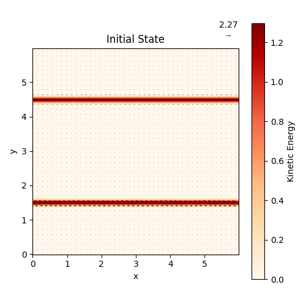
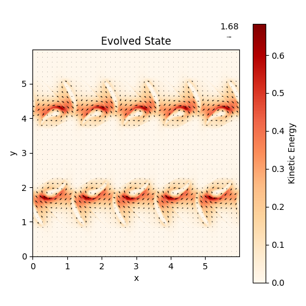

[](https://www.youtube.com/watch?v=Fotni4P2ZQs)

# Framework for Idealized Ocean Models (FRIDOM)

FRIDOM is a modeling framework designed with a singular goal in mind: to provide a high-level interface for the development of idealized ocean models. FRIDOM leverages the power of CUDA arrays on GPU through CuPy, enabling the execution of models at medium resolutions, constrained only by your hardware capabilities, right within Jupyter Notebook.

FRIDOM is designed to solve partial differential equations that are written in the form

$$ \partial_t \mathbf{z} = \mathbf{f}(\mathbf{z}, t) $$

where $\mathbf{z}$ is a state vector containing, for example, the velocity field and the pressure field, and $\mathbf{f}(\mathbf{z}, t)$ represents the tendency term. To create new custom models, one needs to create a class for the state vector and a function for the tendency term. In the base model, there are pre-implemented functions for handling standard tasks, such as time stepping, netCDF output writing, and creating animations. These functions can be overridden if needed.

FRIDOM is restricted to models with structured grids in cartesian coordinates.

Currently, two idealized ocean models are implemented:
- A pseudo-spectral non-hydrostatic Boussinesq model adapted from [ps3d](https://github.com/ceden/ps3d)
- A finite differences rotating shallow water model

**NOTE: FRIDOM is in en early development stage, and as such, it may undergo significant changes.**

## Getting Started

### Prerequisites
A working conda environment. To test the conda installation run the command
```sh
conda list
```
If conda is installed and initialized, it should print a list of the installed packages.

### Installation

1. Clone the repo
```sh
git clone https://github.com/Gordi42/FRIDOM
```
2. Create a new conda environment
```sh
conda create -n fridom python=3.9
```
3. Activate the new environment
```sh
conda activate fridom
```
4. Install cupy
```sh
conda install -c conda-forge cupy
```
5. Install other packages
```sh
pip install netCDF4 plotly==5.18.0 matplotlib tqdm scipy imageio
```
6. Upgrade nbformat
```sh
pip install --upgrade nbformat
```

## Usage

### Creating own models
1. Create a class container to store model settings. For all default settings in the base class, see [here](fridom/Framework/ModelSettingsBase.py).
```python
from fridom.Framework.ModelSettingsBase import ModelSettingsBase
class ModelSettings(ModelSettingsBase):
    def __init__(self, **kwargs):
        """store your model settings here, e.g. self.stratification = ..."""
        super().__init__(n_dims=..., **kwargs)
```
2. Create a model grid (Currently only Cartesian). The base class is [here](fridom/Framework/GridBase.py).
```python
from fridom.Framework.GridBase import GridBase
class Grid(GridBase):
    def __init__(self, mset:ModelSettings):
        """store grid information, for example array of coriolis frequency"""
        super().__init__(mset)
```
3. Create a class for the state vector $\mathbf{z}$. See for example the [state vector](fridom/NonHydrostatic/State.py) of the non-hydrostatic model for more details.
```python
from fridom.Framework.StateBase import StateBase
from fridom.Framework.FieldVariable import FieldVariable
from fridom.Framework.BoundaryConditions import BoundaryConditions, Periodic
class State(StateBase):
    def __init__(self, grid, field_list=None, **kwargs):
        if field_list is None:
            bc = BoundaryConditions([Periodic(mset,0), Periodic(mset,1)])
            field_list = [
                FieldVariable(grid, name="Velocity: u", bc=bc),
                FieldVariable(grid, name="Velocity: v", bc=bc), ...]
        super().__init__(grid, field_list)
        self.constructor = State
```
4. Create the model. The model must include the method ```total_tendency(self)``` which calculates the right hand side of the partial differential equation $\mathbf{f}(\mathbf{z},t)$.
```python
from fridom.Framework.ModelBase import ModelBase
class Model(ModelBase):
    def __init__(self, mset, grid):
        """additional settings may be included in here, 
        for example for the netCDF output writer"""
        super().__init__(mset, grid, State)

    def total_tendency(self):
        """Main function, solves right hand side of PDE"""
        ...

    # for netCDF output, diagnostics, and animations etc.
    # a few more functions must be defined here
```
5. A complete model can be constructed with step 1 to 4. However, for larger projects, it is advisable to build custom plotting modules, as for example [here](fridom/NonHydrostatic/Plot.py) in the non-hydrostatic model.


### Quickstart for existing models
The following code is an example on how to intialize and run the rotating shallow water model with a barotropic instable jet.

```python
# load modules
from fridom.ShallowWater.ModelSettings import ModelSettings
from fridom.ShallowWater.Grid import Grid
from fridom.ShallowWater.InitialConditions import Jet
from fridom.ShallowWater.Model import Model
from fridom.ShallowWater.Plot import Plot
# initialize and run model
mset = ModelSettings(
    Ro=0.5, N=[256,256], L=[6,6])       # create model settings
grid = Grid(mset)                       # create grid
model = Model(mset, grid)               # create model
model.z = Jet(mset, grid)               # set initial conditions
model.run(runlen=2)                     # Run the model
Plot(model.z.ekin())(model.z)           # plot top view of final kinetic energy
```
<p float="left">
  
   
</p>


## Gallery
https://github.com/Gordi42/FRIDOM/assets/118457787/66cca07d-5893-4c1b-af13-901dc78bdd6b


## Author
    * Silvano Rosenau

## License


[MIT](LICENSE.txt)


