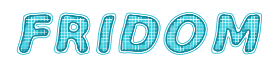

[](https://opensource.org/licenses/MIT)
[](https://gordi42.github.io/fridom/)
[](https://codecov.io/github/Gordi42/fridom)
[](https://doi.org/10.5281/zenodo.14536978)



# Framework for Idealized Ocean Models (FRIDOM)
I started FRIDOM as an ocean modeling framework. It has since turned into an experiment about how far coding agents can progress when the goal is a generalized numerical modeling framework, capable of running realistic global ocean simulations.

## Models are assembled from exchangeable parts

FRIDOM is not one model. Geometry, discretization, equations, time stepping,
boundary conditions: each of them is a separate part, written for the general case,
and a model is built by putting parts together like Lego bricks. A shallow-water
model on a sphere and a non-hydrostatic model in a Cartesian box share most of
their bricks and differ in a few. A new coordinate system or a new numerical scheme
is one more brick.

## The cost of AI: I no longer know my own code

This project started in 2023 and I wrote every line of code myself for the first two and a half years. This amounted to about 30,000 lines. That version is still in this repository, on the `handwritten` branch. In July 2026 I handed the development over to coding agents. The code base exploded and many features were added. However, that came with a cost: I have no overview of the code base anymore. There are parts of it that work, that are tested, and whose details I do not understand. There are almost certainly features in here that I do not know exist.

The hand-written version was mine in a way this one is not.

In order to keep track of what I understand, I only include what I have checked myself in the online documentation at [gordi42.github.io/fridom](https://gordi42.github.io/fridom/). Consequently, it describes only a small part of the framework. Much more is possible than what the docs show.

## Credit belongs to the models this one learned from

The handwritten version of FRIDOM owes its physics to [ps3d](https://github.com/ceden/ps3d) and [pyOM2](https://github.com/ceden/pyOM2), its function-space view to [Shenfun](https://github.com/spectralDNS/shenfun), much of its structure to [Oceananigans.jl](https://github.com/CliMA/Oceananigans.jl), and the idea of an ocean model in JAX to [Veros](https://github.com/team-ocean/veros). It is not possible to know to what extend the agents used these references and it is clear they relied on many uncited works. There are many more ocean models and fluid solvers out there, each of them carefully written and maintained by people who know every part of their code.


## How to cite

```
@software{Rosenau_fridom_2024,
          author = {Rosenau, Silvano Gordian},
          doi = {10.5281/zenodo.14536979},
          month = dec,
          title = {{Fridom: A framework for idealized ocean models.}},
          url = {https://github.com/Gordi42/fridom},
          version = {0.0.1},
          year = {2024}
}
```

## Author

Silvano Rosenau

## License

[MIT](LICENSE)
