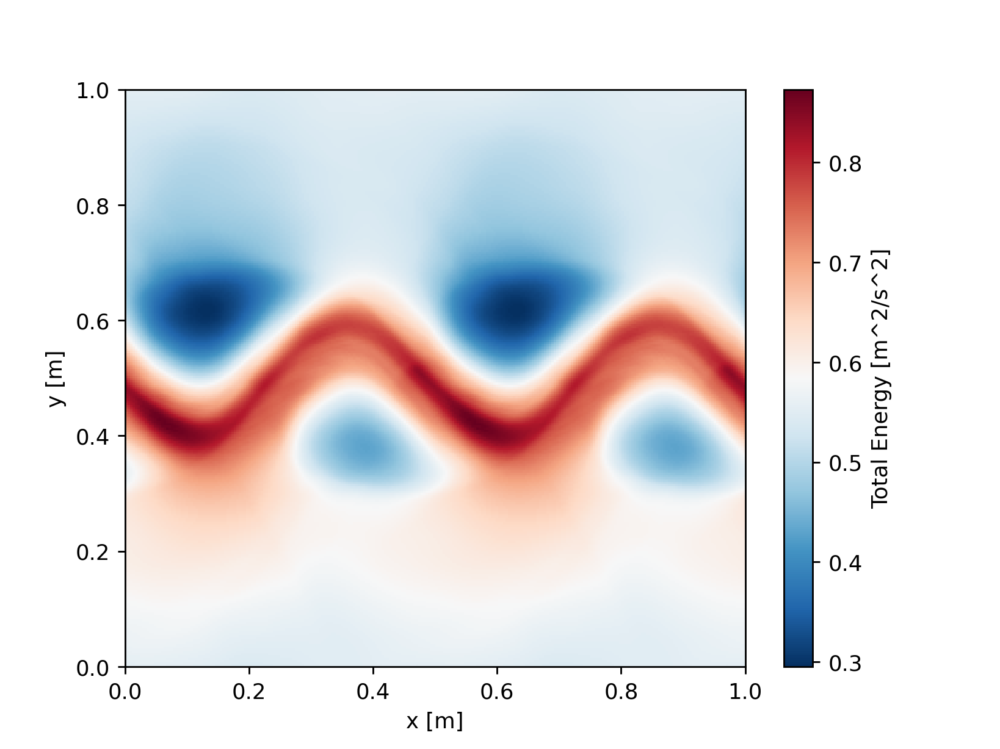

Getting Started
===============

There are several ways to get started with FRIDOM:

- **Explore Examples:** If you'd like to dive right in and experiment with different models, the :doc:`Gallery <auto_examples/index>` is a great place to start. It contains many complete examples that you can run directly.

- **Learn the Basics:** If you prefer to understand the fundamentals of FRIDOM, you can go through the :doc:`Tutorials <tutorials/index>`. They will guide you step-by-step on how to work effectively with the framework.

- **Dive into the Code:** The :doc:`API <fridom_api>` Documentation provides an overview of all classes and functions available in FRIDOM. However, as it may be overwhelming at first, we recommend starting with the Tutorials. Once you're more familiar with the framework, you can refer to the API documentation for details on specific classes or functions.

Quick Example
-------------

Here, we’ll walk through a simple example to show you how to run a model in FRIDOM. We'll initialize and simulate an unstable jet in the 2D Shallow Water model. Due to the instability, eddies will form. You can find an animation of this setup :doc:`here <auto_examples/shallowwater/barotropic_instability>`.

.. code-block:: python
    :caption: Running the 2D Shallow Water Model

    import fridom.shallowwater as sw

    # Create the grid and model settings
    grid = sw.grid.cartesian.Grid(N=(256,256), L=(1,1), periodic_bounds=(True, True))
    mset = sw.ModelSettings(grid=grid, f0=1, csqr=1)
    mset.time_stepper.dt = 0.7e-3
    mset.setup()

    # Create the initial condition
    z = sw.initial_conditions.Jet(mset, width=0.1, wavenum=2, waveamp=0.05)

    # Create the model and run it
    model = sw.Model(mset)
    model.z = z  # set the initial condition
    model.run(runlen=2.5)

    # Plot the final total energy (kinetic + potential)
    model.z.etot.xr.plot(cmap="RdBu_r")

Even though this example uses the 2D Shallow Water model, most of the concepts can be applied to other models as well. The setup can be broken down into the following steps:

1. **Import the Model:** Here, we import the 2D Shallow Water model from the fridom.shallowwater module.
2. **Create a Grid:** Define the grid you wish to use. In this case, we create a Cartesian grid with 256x256 cells over an area of 1m x 1m, periodic in both directions.
3. **Set Up Model Settings:** Create a model settings object and set the model parameters such as the Coriolis frequency ``f0`` and the wave speed ``csqr`` in this example. Each model has its own specific parameters, which can be found in the model's documentation.
4. **Modify Model Modules or Add Custom Components:** For example, you can add an output writer, forcings, or adjust the time step (dt) of the time-stepping scheme, as we do in this example.
5. **Finalize the Model Settings:** Use the setup() method on the model settings object to finalize your configuration.
6. **Create an Initial Condition:** The initial condition can be one of the pre-implemented states (such as the jet in this example), or you can create your own. Detailed instructions for custom initial conditions can be found in the Tutorials.
7. **Initialize and Run the Model:** Instantiate the model with the settings, set the initial condition, and run the simulation. In the example above, we run the model for 2.5 seconds.

In this example, we plot the total energy (kinetic + potential) of the model at the end of the run. To do so, we convert the total energy field into an xarray dataset and use the plot() method to visualize it.

.. note::
    You can run the above code snippet in a Jupyter notebook or in a Python script. If you are running it as a script, you may not see the plot. However you could for example save the plot using matplotlibs `savefig()` method.

Built-in Models:
----------------
At the current stage, FRIDOM provides the following built-in models:

.. grid:: 1 2 2 1
    :margin: 4 4 0 0
    :gutter: 2

    .. grid-item-card::  2D Shallow Water Model
        :link: auto_api/fridom.shallowwater
        :link-type: doc

        A two dimensional rotating shallow water model.

    .. grid-item-card::  3D Nonhydrostatic Model
        :link: auto_api/fridom.nonhydrostatic
        :link-type: doc

        A three dimensional nonhydrostatic model for simulating incompressible flow.

