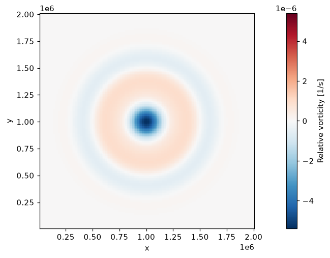

Getting Started
===============

This page runs one complete model. The script below builds a rotating
shallow-water model on a periodic square, raises the free surface over
a patch in the middle, integrates for one inertial period, and plots
what is left. The problem is the classical geostrophic adjustment.

The Script
----------

.. code-block:: python
   :caption: Geostrophic adjustment in the shallow-water model

   import numpy as np

   import fridom as fr
   import fridom.shallowwater2 as sw

   # A doubly periodic square basin, 2000 km on a side.
   grid = fr.spatial.cartesian.Grid(
       shape=(128, 128), extent=2000e3, periodic=True)

   f0 = 1e-4                    # Coriolis parameter in 1/s
   gravity = 9.81               # m/s^2
   depth = 10.0                 # m, so gravity waves travel at 9.9 m/s
   runlen = 2 * np.pi / f0      # one inertial period, about 17.5 hours

   # the largest step below a gravity-wave Courant number of 0.2 that
   # divides the run window
   dt = fr.model.fit_dt(
       runlen, 0.2 * grid.factor("x").dx / np.sqrt(gravity * depth))

   # A rotating shallow-water model, assembled from modules.
   model = sw.Model(
       grid=grid,
       core=sw.Core(gravity=gravity, depth=depth),
       coriolis=sw.modules.FPlaneCoriolis(f0=f0),
       advection=sw.SadournyAdvection(),
       time_stepper=fr.model.time_steppers.AdamBashforth(dt, order=3))

   # Raise the free surface by one metre over a patch in the middle of the
   # basin. The pressure of the shallow-water model is the gravitational
   # acceleration times the surface displacement.
   def bump(x, y):
       radius_squared = (x - 1000e3) ** 2 + (y - 1000e3) ** 2
       return gravity * np.exp(-radius_squared / (2 * 100e3 ** 2))

   model.set_fields(p=bump)

   # Integrate. The whole loop is compiled once into a single jax function.
   model.run(runlen=runlen)

   # Plot the relative vorticity of the adjusted state.
   model.state.rel_vort.xr.plot(x="x", cmap="RdBu_r")

The run takes 200 steps and a few seconds on a laptop, most of it
compilation.

   Relative vorticity after one inertial period. The raised patch has
   settled into an anticyclone in geostrophic balance, the dark core in
   the middle. The rings around it are the gravity waves that carried
   off the part of the initial displacement that could not stay
   balanced.

Step by Step
------------

The Grid
~~~~~~~~

``fr.spatial.cartesian.Grid`` builds a uniform Cartesian grid from a
shape, an extent, and the periodicity of each axis. A single number for
the extent is broadcast to every axis, and so is a single boolean for
the periodicity, so this grid is 2000 km wide and periodic in both
directions. Each axis keeps its own one dimensional mesh, and
``grid.factor("x")`` returns the one along x, whose ``dx`` is the cell
width.

The Model
~~~~~~~~~

``sw.Model`` is a factory function. It takes the parts of the model as
separate modules and returns an assembled ``fr.model.Model``. There is
no settings object. Each physical parameter lives on the module that
uses it, so the gravitational acceleration and the resting depth are
arguments of the core (``sw.Core``) rather than of the model.

Rotation and advection are opt-in. A model built without a
``coriolis=`` argument has no Coriolis term at all, and one built
without an ``advection=`` argument stays linear. Changing the physics
means swapping a module.

``fr.model.fit_dt`` picks the largest time step below a given bound
that divides the run window. The bound here is a gravity-wave Courant
number of 0.2, which keeps the fastest waves from crossing a grid cell
in a single step.

The Initial Condition
~~~~~~~~~~~~~~~~~~~~~

``model.set_fields`` writes initial conditions onto the prognostic
fields. A value can be a function of the physical coordinates, as here,
or an array, or an existing field. Prognostic fields that are not named
in the call keep their initial value of zero, so the velocities ``u``
and ``v`` start at rest.

The shallow-water pressure ``p`` is the gravitational acceleration
times the free-surface displacement, which is why a bump of one metre
enters as ``gravity`` times a Gaussian.

Running the Model
~~~~~~~~~~~~~~~~~

``model.run`` advances to a target given either as a number of
``steps``, as a duration (``runlen``), or as an absolute ``end_time``.
There is no Python time loop. FRIDOM lowers the whole integration into
a single ``jax.jit`` over a chunked ``lax.scan``, compiles it once, and
then runs the compiled function. The call returns a ``RunResult``,
which reports the number of steps taken, the model time reached, the
compile time, and the achieved step rate.

Looking at the Result
~~~~~~~~~~~~~~~~~~~~~

``model.state`` holds the prognostic fields of the model together with
the diagnostics derived from them, such as the relative vorticity used
above. Every field has an ``.xr`` view that presents it as an
``xarray.DataArray`` with named and labeled coordinates, so any xarray
plot works on it. Plotting needs ``xarray`` and ``matplotlib``, which
come with the ``dev`` extra.

Where to Go Next
----------------

The :doc:`Gallery <auto_examples/index>` holds complete experiments in
every model. Each one is executed when this documentation is built, so
the code on those pages is the code that ran. :doc:`Advanced Topics
<advanced/index>` covers the machinery behind the models and the
practical side of running them.
